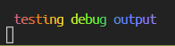
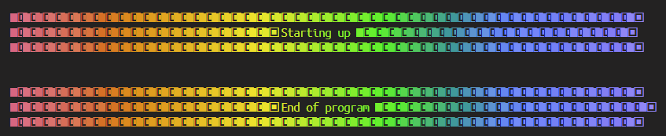

# Chroma Console, aka 'ChCo' 

_(for VSC Terminal Use Only)_

A simple, yet opinionated, helper package for logging (colorful!) output to the console.


**Rainbow font, with one import.** No configuration needed, just works.

```
import { ChCo } from 'chroma-console';

(...)

ChCo.log('testing debug output');
```




Big colorful buffers incase you need a visual blurb somewhere...
```
import { ChCo } from 'chroma-console';

(...)

ChCo.start();
ChCo.end();
```



Uses [🔗 gradient-string](https://github.com/bokub/gradient-string)

Please note if you want more options, please check out [🔗 Chalk](https://github.com/chalk/chalk),[🔗 Chalk Animation](https://github.com/bokub/chalk-animation), or[🔗colorfy](https://github.com/kippisone/colorfy)


### TODO -

* types
* readme, with pictures
* if you set the color wrong, error out
* different colors (red, orange, yellow, etc)
* bool flag helper
